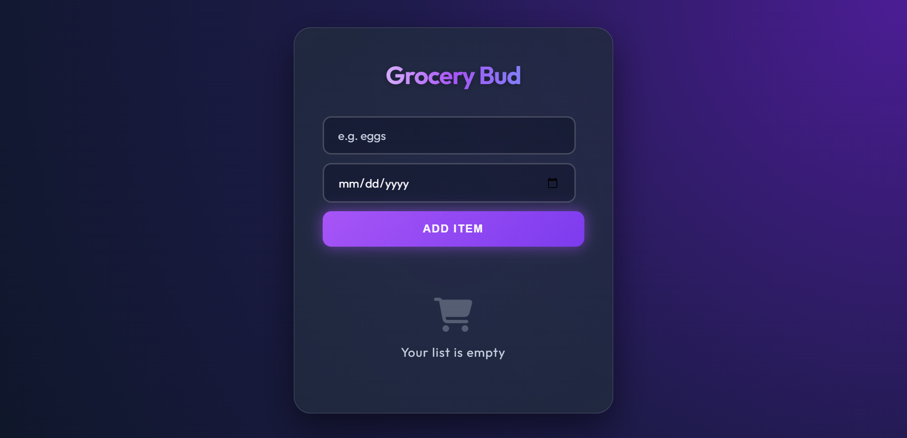

# Grocery Bud 🛒

[](https://gitlab.com/sarshijkarn/grocery-bud-nce.git)
[](https://developer.mozilla.org/en-US/docs/Web/JavaScript)
[](https://developer.mozilla.org/en-US/docs/Web/CSS)

**Grocery Bud** is a high-performance, visually stunning grocery list manager built with a "Cyber-Premium" design philosophy. It combines the simplicity of Vanilla JavaScript with the power of modern CSS to deliver a premium user experience.

---

## 📸 Preview



_Experience the vibrant, glassmorphic interface designed for clarity and style._

---

## ✨ Key Features

- **🚀 Cyber-Premium UI**: A stunning dark-mode aesthetic featuring deep radial gradients and glassmorphic elements.
- **⚡ Real-time CRUD**: Seamlessly add, edit, and delete items with instant UI updates.
- **📅 Smart Date Tracking**: Assign due dates to your groceries to stay organized and avoid missing essentials.
- **💾 Persistent Storage**: Leverages `LocalStorage` to ensure your data stays safe, even after closing the browser.
- **📱 Ultra Responsive**: Optimized for every screen size, from high-end desktops to mobile devices.
- **🎨 Interactive Feedback**: Smooth micro-animations, neon glow effects, and hover transitions for a "living" interface.

---

## 🛠️ Tech Stack

- **Core**: HTML5 & Semantic Web Elements
- **Style**: CSS3 Custom Design System (Glassmorphism, CSS Variables, Flex/Grid)
- **Logic**: ES6+ JavaScript (Modular Components)
- **Icons**: Font Awesome 6 (Pro-grade iconography)
- **Typography**: Google Fonts - [Outfit](https://fonts.google.com/specimen/Outfit)

---

## 🚀 Getting Started

1. **Clone the repo**:
   ```bash
   git clone https://gitlab.com/sarshijkarn/grocery-bud-nce.git
   ```
2. **Open the App**: Simply launch `index.html` in any modern web browser.

---

## 🔗 Project Link

Explore the source code on [GitLab](https://gitlab.com/sarshijkarn/grocery-bud-nce.git).

---

### Credits

Built with ❤️ by **[SARSHIJ KARN](https://sarshijkarn.com.np)**
